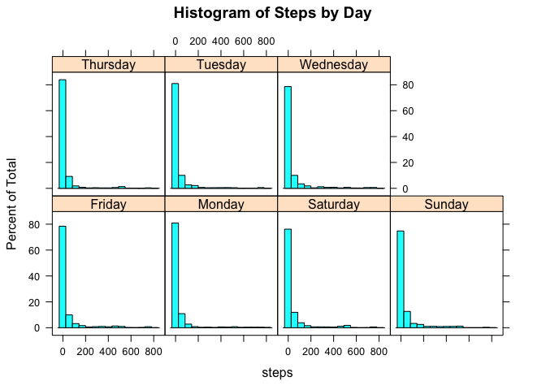
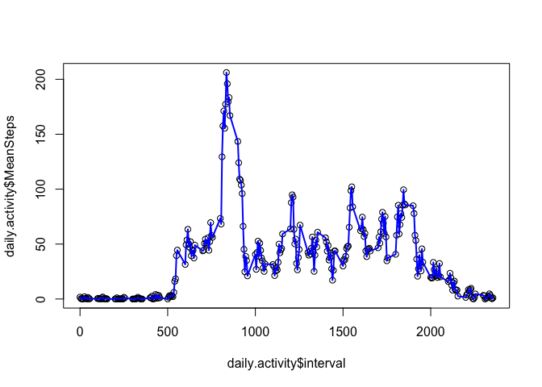
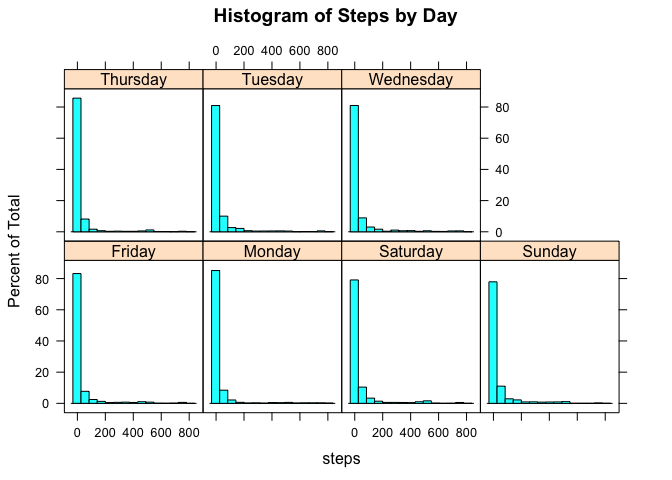
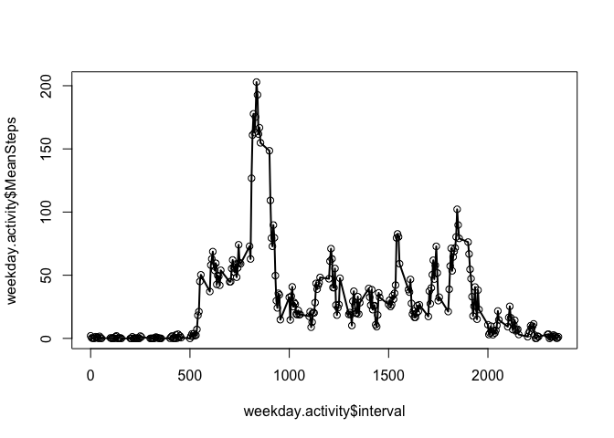
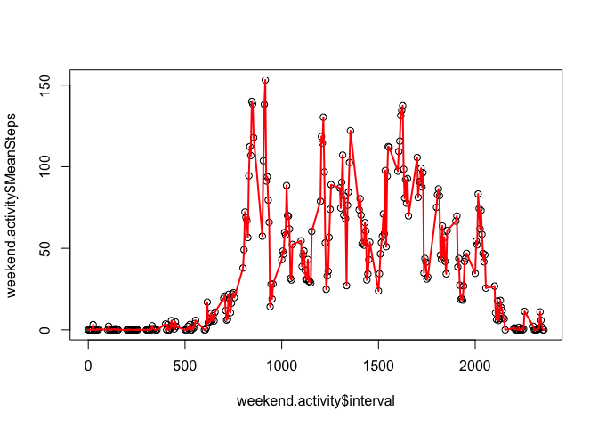

# Reproducible Research: Peer Assessment 1
Jarren Santos  
2/13/2017  


## Loading and preprocessing the data

We will be using the `plyr`, `dplyr`, and `lattice` library for this project.

```r
library(plyr)
library(dplyr)
```

```
## 
## Attaching package: 'dplyr'
```

```
## The following objects are masked from 'package:plyr':
## 
##     arrange, count, desc, failwith, id, mutate, rename, summarise,
##     summarize
```

```
## The following objects are masked from 'package:stats':
## 
##     filter, lag
```

```
## The following objects are masked from 'package:base':
## 
##     intersect, setdiff, setequal, union
```

```r
library(lattice)
```

Make sure to clone this repository onto your computer.  Aftewards, set the working directory to the forked repository.

```r
setwd("~/Desktop/RepData_PeerAssessment1")
```

Access the data by clicking onto `activity.zip` to open up the .zip file.  Then proceed to upload the data into R.

```r
activity.original <- read.csv("activity.csv")
```


## What is mean total number of steps taken per day?

Note two things about the `activity.original` dataset:
1. There are `NA` values in the `activity.original$steps` column.
2. The `activity.original$date` column is currently in a format that prevents us from seeing the average number of steps taken per day.

In order to properly answer this question, I will do two things:

1. Omit the `NA` values in the `activity.original$steps` column so we get an accurate mean.

```r
activity <- activity.original[!is.na(activity.original$steps), ]  # get rid of any `NA` values in the `steps` column
any(is.na(activity$steps))  # check to see if any `NA` values still exist
```

```
## [1] FALSE
```

2. Create a `activity.original$day` column based on the given dates, and use these days to group the means by day.

```r
activity$day <- format(as.Date(activity$date, format = "%Y-%m-%d"), "%A")   # grabs Day using the date
```

With our data set formatted, we can now answer the questions for this section.

Here is a histogram of the total number of steps taken each day:

```r
histogram(~steps|factor(day), data = activity, main = "Histogram of Steps by Day")
```

<!-- -->

Here is a table that consists of the total number of steps, the mean number of steps, and the median number of steps per day.  Note that the medians for each group are all zero (we can clearly see this from the previous histogram).

```r
steps.table <- ddply(activity, .(day), summarize,  TotalSteps = sum(steps), MeanSteps = mean(steps), MedSteps = median(steps))
new.order <- c("Sunday", "Monday", "Tuesday", "Wednesday", "Thursday", "Friday", "Saturday")
steps.table <- steps.table[match(new.order, steps.table$day), ]    # ordering the data by day
steps.table
```

```
##         day TotalSteps MeanSteps MedSteps
## 4    Sunday      85944  42.63095        0
## 2    Monday      69824  34.63492        0
## 6   Tuesday      80546  31.07485        0
## 7 Wednesday      94326  40.94010        0
## 5  Thursday      65702  28.51649        0
## 1    Friday      86518  42.91567        0
## 3  Saturday      87748  43.52579        0
```


## What is the average daily activity pattern?

We first want to create a data frame that has the averages of steps taken per interval.  We will use the `ddply()` function to help us with this.

```r
daily.activity <- ddply(activity, .(interval), summarize, MeanSteps = mean(steps))
```

Afterwards, we will use the base plotting system in R to create our daily activity pattern graph.

```r
plot(daily.activity$interval, daily.activity$MeanSteps)
lines(daily.activity$interval, daily.activity$MeanSteps, type = "l", col = "blue", lwd = 2)
```

<!-- -->

In order to obtain the maximum number of steps, we can use the `max()` function on the `activity$MeanSteps` column.

```r
max(daily.activity$MeanSteps)
```

```
## [1] 206.1698
```


## Imputing missing values

So let's calculate the total number of missing values in the dataset.  We will first use `complete.cases()` to filter the content of the original dataset.  Then, we will subtract the number of rows in the new dataset from the number of rows in the original dataset.

```r
activity.clean <- activity.original[complete.cases(activity.original), ]
any(is.na(activity))    # checks for any NA values throughout the entire dataset
```

```
## [1] FALSE
```

```r
dim(activity.original)[1] - dim(activity.clean)[1]  # total number of missing values in dataset
```

```
## [1] 2304
```

We have 2,304 values missing from this dataset.  With this in mind, we will fill those values up with the median number of steps per day.  We can pull those values from the `steps.table` data frame that we created in a previous section.  This will result in `activity.impute`, a new dataset with imputed missing values.

```r
activity.impute <- activity.original
activity.impute$day <- format(as.Date(activity.impute$date, format = "%Y-%m-%d"), "%A")   
    # grabs Day using the date
activity.impute$steps[is.na(activity.impute$steps) & activity.impute$day == "Sunday"] <- steps.table[1, 4]
activity.impute$steps[is.na(activity.impute$steps) & activity.impute$day == "Monday"] <- steps.table[2, 4]
activity.impute$steps[is.na(activity.impute$steps) & activity.impute$day == "Tuesday"] <- steps.table[3, 4]
activity.impute$steps[is.na(activity.impute$steps) & activity.impute$day == "Wednesday"] <- steps.table[4, 4]
activity.impute$steps[is.na(activity.impute$steps) & activity.impute$day == "Thursday"] <- steps.table[5, 4]
activity.impute$steps[is.na(activity.impute$steps) & activity.impute$day == "Friday"] <- steps.table[6, 4]
activity.impute$steps[is.na(activity.impute$steps) & activity.impute$day == "Saturday"] <- steps.table[7, 4]
```

Here is a histogram of the total number of steps taken each day in `activity.impute`:

```r
histogram(~steps|factor(day), data = activity.impute, main = "Histogram of Steps by Day")
```

<!-- -->

Here is a table that consists of the total number of steps, the mean number of steps, and the median number of steps per day in `activity.impute`.  Note that the medians for each group are all zero (we can clearly see this from the previous histogram).

```r
steps.table1 <- ddply(activity.impute, .(day), summarize,  TotalSteps = sum(steps), MeanSteps = mean(steps), MedSteps = median(steps))
new.order <- c("Sunday", "Monday", "Tuesday", "Wednesday", "Thursday", "Friday", "Saturday")
steps.table1 <- steps.table1[match(new.order, steps.table1$day), ]    # ordering the data by day
steps.table1
```

```
##         day TotalSteps MeanSteps MedSteps
## 4    Sunday      85944  37.30208        0
## 2    Monday      69824  26.93827        0
## 6   Tuesday      80546  31.07485        0
## 7 Wednesday      94326  36.39120        0
## 5  Thursday      65702  25.34799        0
## 1    Friday      86518  33.37886        0
## 3  Saturday      87748  38.08507        0
```

Because the median value for all days is 0, neither the total number of steps or the median number of steps changed in this new table.  However, the mean number of steps differ and brought all of the means down.  Imputing missing data on the estimates can drastically affect summary measures, so take caution when doing so.


## Are there differences in activity patterns between weekdays and weekends?

We will be using the `activity.impute` dataset because it is the dataset that has the filled-in missing values.

We can now split those two groups up into the two groups of interest: weekday and weekend.  To do this, we will implement the `ifelse()` function and the `grepl()` functions to group them properly.

```r
test <- activity.impute
test$dayGroup <- ifelse(grepl("Monday", test$day), "Weekday", 
                        ifelse(grepl("Tuesday", test$day), "Weekday", 
                               ifelse(grepl("Wednesday", test$day), "Weekday", 
                                      ifelse(grepl("Thursday", test$day), "Weekday",
                                             ifelse(grepl("Friday", test$day), "Weekday", "Weekend")))))
```

We can create two data frames--one for weekdays and one for weekends--to make it easier for us to separate the data.

```r
test.weekday <- filter(test, dayGroup == "Weekday")
test.weekend <- filter(test, dayGroup == "Weekend")
```

We want to create a data frame that has the averages of steps taken per interval.  We will use the `ddply()` function to help us with this.

```r
weekday.activity <- ddply(test.weekday, .(interval), summarize, MeanSteps = mean(steps))
weekend.activity <- ddply(test.weekend, .(interval), summarize, MeanSteps = mean(steps))
```

Afterwards, we will use the base plotting system in R to create our daily activity pattern graph for weekdays and weekends.  I'll separate these into two separate code chunks:

* Weekday (black)

```r
plot(weekday.activity$interval, weekday.activity$MeanSteps)
lines(weekday.activity$interval, weekday.activity$MeanSteps, type = "l", col = "black", lwd = 2)
```

<!-- -->

* Weekend (red)

```r
plot(weekend.activity$interval, weekend.activity$MeanSteps)
lines(weekend.activity$interval, weekend.activity$MeanSteps, type = "l", col = "red", lwd = 2)
```

<!-- -->
